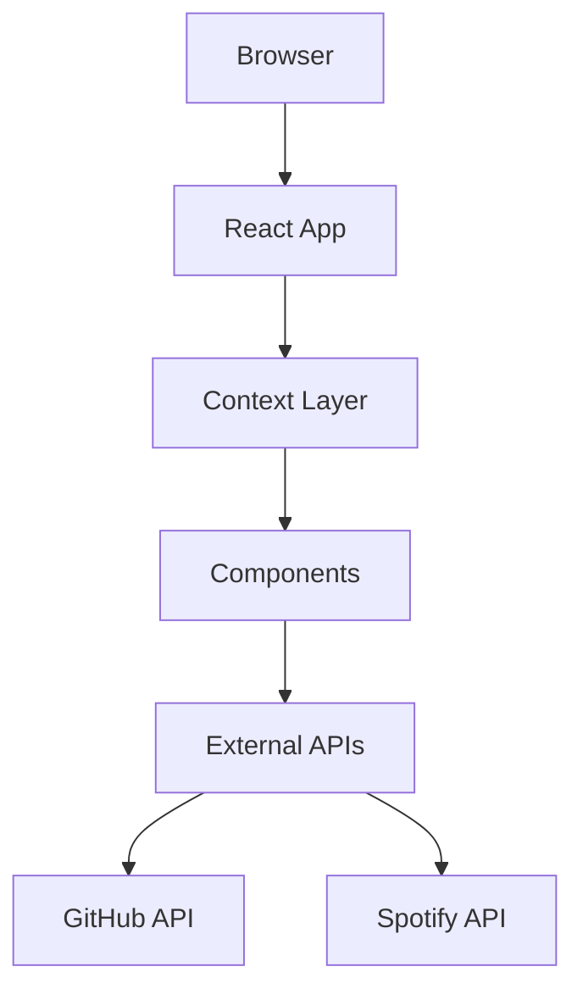

# Personal Portfolio

A retro-inspired personal portfolio website featuring terminal aesthetics, CRT effects, and real-time integrations.

[](https://github.com/hassarch/personal-portfolio/actions)
[](LICENSE)

## Overview

A modern portfolio with nostalgic terminal aesthetics—featuring an animated boot sequence, interactive command interface, live GitHub stats, and optional Spotify integration.

## Features

- **Terminal Interface** — Interactive command system with history and keyboard shortcuts (Ctrl+K)
- **Boot Sequence** — ASCII art animation on first visit (session-aware)
- **Live GitHub Stats** — Real-time metrics and contribution heatmap
- **Spotify Integration** — Now playing widget with playback controls (optional)
- **Bento Grid Layout** — Responsive tiles with clock, location, and stats
- **Retro Aesthetics** — CRT scanlines, monochrome palette, macOS-style frames
- **Theme Toggle** — Persistent light/dark mode
- **Docker Ready** — Multi-stage build with Nginx and health checks

## Architecture



**Structure:**
- **Context Layer** — Theme and terminal state management
- **Component Layer** — UI components with custom hooks for data fetching and animations
- **External APIs** — GitHub stats and Spotify integration


## Tech Stack

| Category | Technology |
|----------|------------|
| **Language** | TypeScript |
| **Framework** | React 18 |
| **Build Tool** | Vite 5 |
| **Styling** | Tailwind CSS 3 |
| **Animation** | Motion 12 (Framer Motion successor) |
| **State Management** | React Context + TanStack Query |
| **UI Components** | Radix UI (Label, Toast, Tooltip) |
| **Form Handling** | React Hook Form + Zod |
| **Icons** | Lucide React |
| **Testing** | Vitest + Testing Library |
| **Linting** | ESLint 9 + TypeScript ESLint |
| **CI/CD** | GitHub Actions |
| **Container** | Docker (multi-stage) + Nginx |
| **Analytics** | Vercel Analytics |

## Project Structure

```text
personal-portfolio/
├── src/
│   ├── components/
│   │   ├── bento/              # Bento grid tiles
│   │   │   ├── ClockTile.tsx
│   │   │   ├── ContributionHeatmap.tsx
│   │   │   ├── GithubStatsTile.tsx
│   │   │   └── LocationTile.tsx
│   │   ├── ui/                 # Radix UI primitives
│   │   │   ├── button.tsx
│   │   │   ├── input.tsx
│   │   │   ├── label.tsx
│   │   │   ├── textarea.tsx
│   │   │   ├── toast.tsx
│   │   │   ├── toaster.tsx
│   │   │   └── tooltip.tsx
│   │   ├── AboutSection.tsx
│   │   ├── BackToTop.tsx
│   │   ├── BootSequence.tsx     # Boot animation
│   │   ├── CommandHistory.tsx   # Terminal output
│   │   ├── CommandInput.tsx     # Terminal input
│   │   ├── ContactSection.tsx
│   │   ├── Footer.tsx
│   │   ├── HeroSection.tsx
│   │   ├── Navbar.tsx
│   │   ├── ProjectsSection.tsx
│   │   ├── SkillsSection.tsx
│   │   ├── SpotifyPlayer.tsx    # Now playing widget
│   │   ├── Starfield.tsx        # Animated background
│   │   ├── TerminalFrame.tsx    # macOS window frame
│   │   ├── TerminalOverlay.tsx  # Scanline effects
│   │   └── TerminalWindow.tsx   # Full terminal UI
│   ├── contexts/
│   │   ├── TerminalContext.tsx  # Terminal state
│   │   └── ThemeContext.tsx     # Theme state
│   ├── hooks/
│   │   ├── useCountUp.ts        # Number animations
│   │   ├── useGithubContributions.ts
│   │   ├── useGithubStats.ts
│   │   ├── useLocalClock.ts     # Real-time clock
│   │   ├── useScrollAnimation.ts
│   │   ├── useScrollNavigation.ts
│   │   ├── useTypingEffect.ts
│   │   └── use-toast.ts
│   ├── lib/
│   │   ├── commandInterpreter.ts # Command parser
│   │   └── utils.ts
│   ├── constants/
│   │   ├── asciiArt.ts          # ASCII art & boot messages
│   │   └── profile.ts           # Personal data
│   ├── App.tsx
│   ├── index.css                # Global styles
│   └── main.tsx
├── public/
│   ├── robots.txt
│   └── song.mp3
├── .github/workflows/
│   └── ci.yml                   # CI/CD pipeline
├── Dockerfile                   # Multi-stage production build
├── docker-compose.yml           # Container orchestration
├── nginx.conf                   # Nginx configuration
├── get-spotify-token.cjs        # Spotify token helper
├── vite.config.ts
├── tsconfig.json
└── package.json
```

## Getting Started

### Prerequisites

- **Node.js** 20 or higher
- **npm**, **yarn**, or **bun**
- (Optional) **Docker** for containerized deployment

### Installation

```bash
# Clone the repository
git clone https://github.com/hassarch/personal-portfolio.git
cd personal-portfolio

# Install dependencies
npm install
```

### Development

```bash
# Start development server (localhost:5173)
npm run dev
```

### Production Build

```bash
# Build optimized production bundle
npm run build

# Preview production build locally
npm run preview
```

### Testing

```bash
# Run tests once
npm test

# Watch mode for development
npm run test:watch

# Interactive UI mode
npm run test:ui
```

### Linting

```bash
# Run ESLint
npm run lint
```

## Configuration

### Environment Variables

Create a `.env` file in the root directory:

```env
# GitHub API (required for stats tile)
VITE_GITHUB_TOKEN=ghp_your_github_personal_access_token

# Spotify API (optional - tile shows fallback if not configured)
VITE_SPOTIFY_CLIENT_ID=your_spotify_client_id
VITE_SPOTIFY_CLIENT_SECRET=your_spotify_client_secret
VITE_SPOTIFY_REFRESH_TOKEN=your_spotify_refresh_token
```

<details>
<summary><strong>How to get GitHub token</strong></summary>

1. Go to [GitHub Settings → Developer settings → Personal access tokens](https://github.com/settings/tokens)
2. Generate new token (classic)
3. Select scopes: `read:user`, `repo` (for public repos)
4. Copy token and add to `.env`
</details>

<details>
<summary><strong>How to get Spotify credentials</strong></summary>

1. Create app at [Spotify Developer Dashboard](https://developer.spotify.com/dashboard)
2. Note your Client ID and Client Secret
3. Add redirect URI: `http://localhost:5173/callback`
4. Use the included helper script to get a refresh token:
   ```bash
   node get-spotify-token.cjs
   ```
5. Follow the authorization flow in your browser
6. Add all three values to `.env`
</details>

### Personalization

Edit `src/constants/profile.ts` to customize personal information:

```typescript
export const NAME = 'Your Name';
export const LOCATION = 'Your City';
export const TIMEZONE = 'America/New_York';
export const TIMEZONE_LABEL = 'EST';
export const GITHUB_USERNAME = 'yourusername';
export const EMAIL = 'your@email.com';
export const PHONE = '+1 234 567 8900';
export const RESUME_URL = 'https://example.com/resume.pdf';

export const LINKEDIN_URL = 'https://www.linkedin.com/in/yourprofile/';
export const X_URL = 'https://x.com/yourhandle';
```

This single file propagates changes across the entire site.

## Docker Deployment

### Using Docker Compose (Recommended)

```bash
# Build and start container
docker-compose up --build

# Run in detached mode
docker-compose up -d

# View logs
docker-compose logs -f

# Stop container
docker-compose down
```

Access the site at `http://localhost:3000`

### Manual Docker Build

```bash
# Build image
docker build -t portfolio-app .

# Run container
docker run -p 3000:80 portfolio-app

# Run in detached mode with name
docker run -d -p 3000:80 --name portfolio portfolio-app

# View logs
docker logs -f portfolio

# Stop and remove
docker stop portfolio && docker rm portfolio
```

The multi-stage Dockerfile builds with Node.js 20 Alpine and serves with Nginx (~50MB final image).

## CI/CD

GitHub Actions workflow (`.github/workflows/ci.yml`) runs on every push to `main`/`master`:

- ✅ **Install dependencies** — `npm ci`
- ✅ **Lint code** — `npm run lint`
- ✅ **Build production bundle** — `npm run build`

The workflow ensures code quality and build integrity before deployment.

## Customization

### Adding New Terminal Commands

Edit `src/lib/commandInterpreter.ts`:

```typescript
const commands: Record<string, CommandHandler> = {
  mycommand: () => ({
    output: 'Command output here',
    type: 'success'
  }),
  // ... existing commands
};
```

### Modifying Projects

Edit the `projects` array in `src/components/ProjectsSection.tsx`:

```typescript
const projects: Project[] = [
  {
    title: 'Project Name',
    description: 'Brief description',
    technologies: ['React', 'TypeScript', 'Tailwind'],
    githubUrl: 'https://github.com/user/repo',
    liveUrl: 'https://demo.example.com',
    date: '2024-01-15',
  },
  // ... more projects
];
```

### Creating New Bento Tiles

1. Create component in `src/components/bento/`
2. Wrap with `<TerminalFrame>` for consistent styling
3. Use the `bento-tile` and `bento-tile-content` classes
4. Add to grid in the relevant section component

Example structure:

```tsx
<TerminalFrame
  title="~/my-tile"
  flush
  className="bento-tile"
  contentClassName="bento-tile-content"
>
  <div className="flex h-full flex-col">
    <span className="bento-eyebrow">$ my-command</span>
    {/* Your content */}
  </div>
</TerminalFrame>
```

### Styling

The design uses:
- **Tailwind utility classes** for component styles
- **CSS custom properties** in `index.css` for theme colors
- **Monospace fonts** (`font-mono`) for terminal aesthetic
- **Motion variants** for consistent animations

Edit theme colors in `src/index.css`:

```css
:root {
  --background: 0 0% 100%;
  --foreground: 0 0% 10%;
  --primary: 0 0% 10%;
  /* ... */
}

.dark {
  --background: 0 0% 10%;
  --foreground: 0 0% 95%;
  /* ... */
}
```

## Testing

The project includes comprehensive tests for critical functionality:

**Covered Areas:**
- ✅ Terminal command interpreter
- ✅ Terminal overlay behavior
- ✅ Terminal frame rendering
- ✅ Typing effect hook
- ✅ Count-up animation hook
- ✅ Local clock functionality
- ✅ Scroll navigation hook
- ✅ ASCII art rendering

**Test Files:**
```text
src/components/TerminalFrame.test.tsx
src/components/TerminalOverlay.test.tsx
src/hooks/useCountUp.test.ts
src/hooks/useLocalClock.test.ts
src/hooks/useScrollNavigation.test.tsx
src/lib/commandInterpreter.test.ts
src/constants/asciiArt.test.ts
```

## Deployment

Deploy to any static hosting platform:

### Vercel (Recommended)

```bash
npm i -g vercel
vercel
```

Or connect your GitHub repository in the Vercel dashboard.

### Netlify

```bash
npm run build
# Drag and drop the 'dist' folder to Netlify
```

Or connect via Git with these settings:
- **Build command:** `npm run build`
- **Publish directory:** `dist`

### Cloudflare Pages

1. Connect your GitHub repository
2. **Build command:** `npm run build`
3. **Output directory:** `dist`
4. Set environment variables in dashboard

### GitHub Pages

```bash
npm run build
# Push 'dist' folder to gh-pages branch
```

**Deployment Settings:**
- Build command: `npm run build`
- Output directory: `dist`
- Node version: 20+
- SPA routing: fallback to `index.html`

## Terminal Commands

The interactive terminal supports the following commands:

| Command | Description |
|---------|-------------|
| `help` | Display all available commands |
| `about` | Show information about the developer |
| `skills` | List technical skills and technologies |
| `projects` | Display featured projects |
| `contact` | Show contact information |
| `github` | Open GitHub profile in new tab |
| `linkedin` | Open LinkedIn profile in new tab |
| `email` | Open default email client |
| `x` | Open X (Twitter) profile |
| `clear` | Clear terminal history |
| `theme` | Toggle light/dark mode |
| `time` | Display current time in timezone |

Access the terminal by pressing **Ctrl+K** (or **Cmd+K** on Mac).

## License

This project is open source and available under the [MIT License](LICENSE).

## Acknowledgments

- Icons by [Lucide](https://lucide.dev/)
- UI primitives by [Radix UI](https://www.radix-ui.com/)
- Animations by [Motion](https://motion.dev/)
